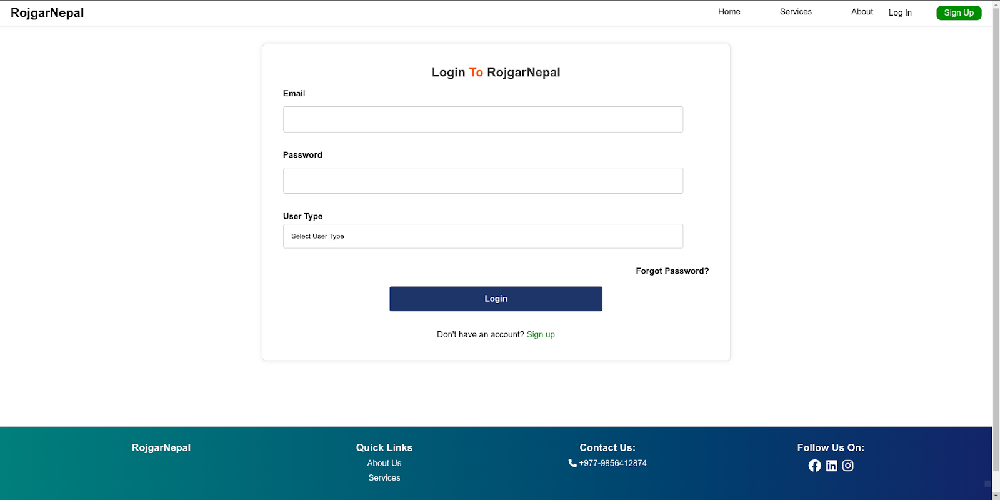
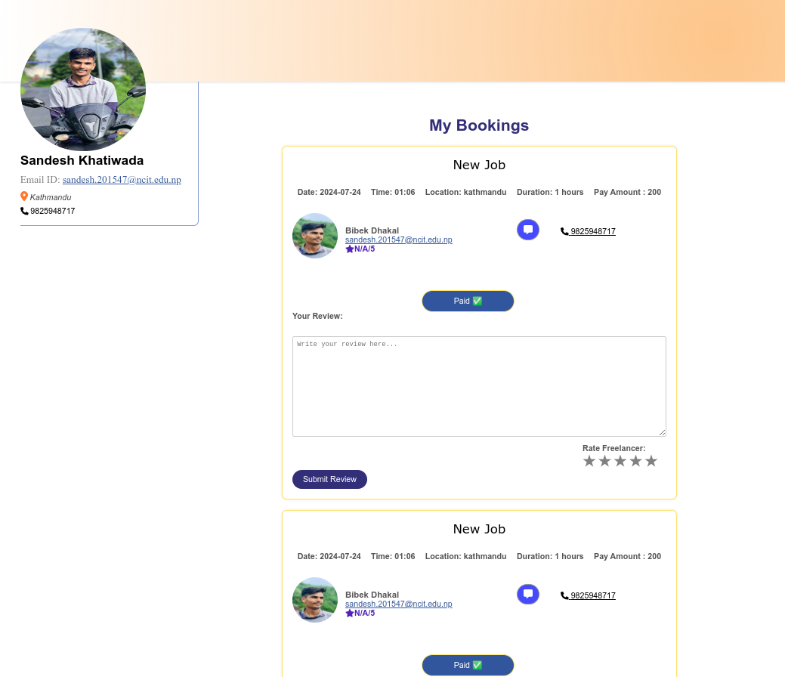
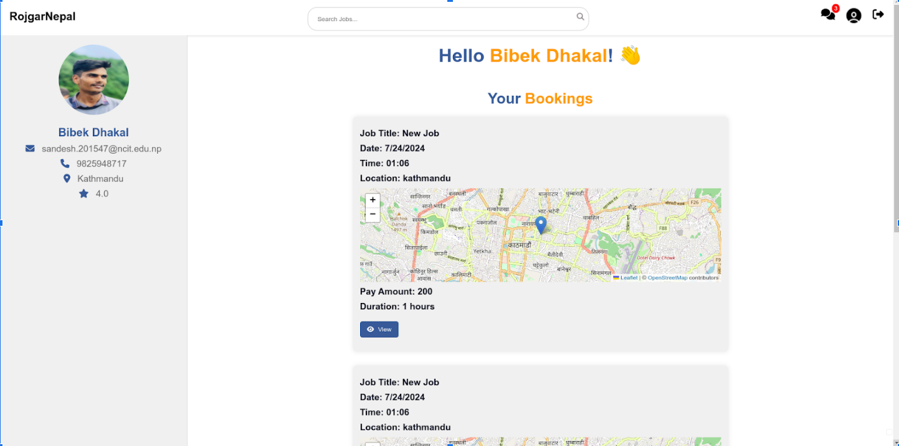
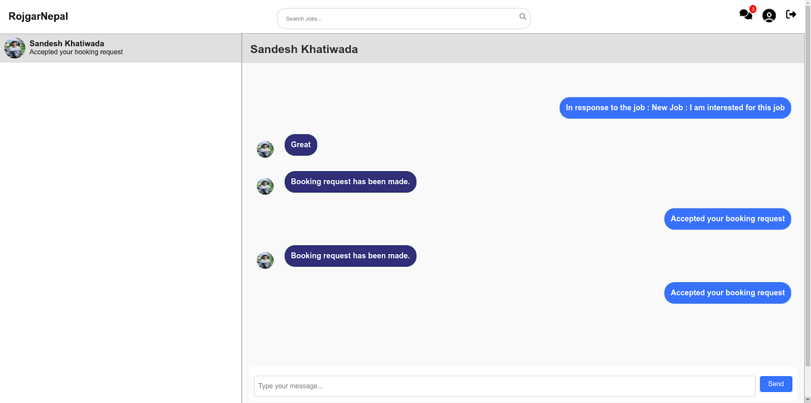
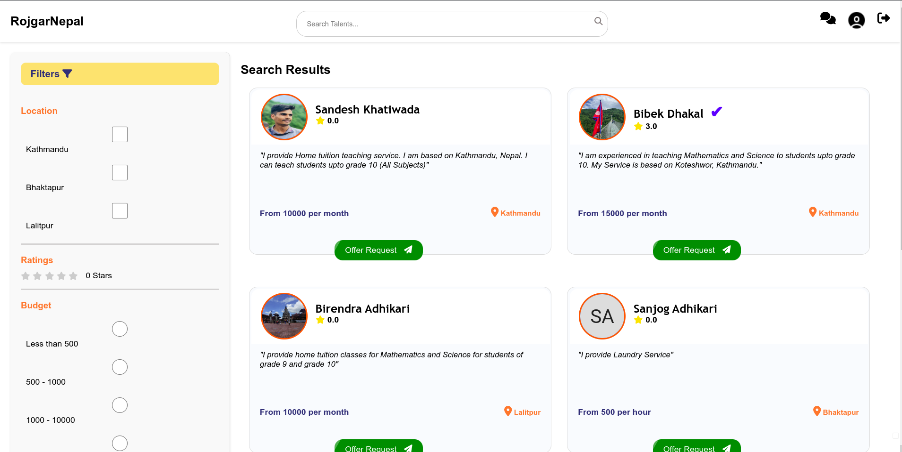
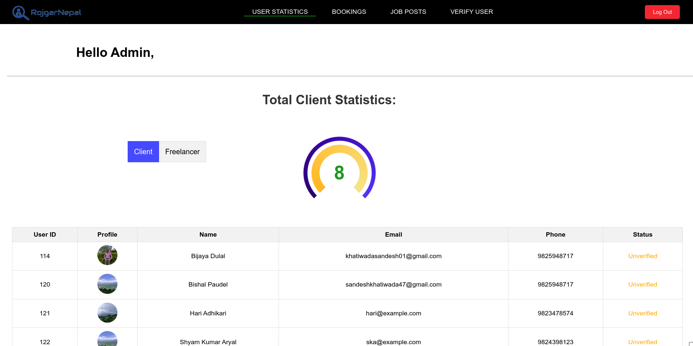

# RojgarNepal 

RojgarNepal is a comprehensive platform designed to connect freelancers with clients, enabling seamless job postings, applications, and communication. The project involves multiple modules including client, server, admin, and recommendation systems.

## Table of Contents
1. [Introduction](#introduction)
2. [Features](#features)
3. [Project Structure](#project-structure)
4. [Installation and Setup](#installation-and-setup)
    1. [Server](#server)
    2. [Client](#client)
    3. [Admin](#admin)
    4. [Recommendation System](#recommendation-system)
5. [Usage](#usage)
6. [Contributing](#contributing)
7. [License](#license)
8. [Screenshots](#screenshots)

## Introduction
RojgarNepal is a job portal designed to facilitate connections between freelancers and clients. It includes features such as job postings, applications, user profiles, and communication tools.

## Features
- Token Based User Authentication and Authorization
- Job Posting and Application
- Real-time Chat between Clients and Freelancers using socket.io
- Admin Dashboard for Managing Users and Jobs
- Recommendation System for Freelancer Suggestions using Collaborative Filtering Technique

## Project Structure
The project is divided into several directories, each handling a specific part of the application:

1. **admin**: React project for the admin dashboard.
2. **client**: React project for the frontend.
3. **server**: Node.js project for the backend.
4. **recommendation**: Flask project for the recommendation system.

## Installation and Setup

To run the project, follow the instructions below:

 **Clone the repository:**

 
    git clone git@github.com:sandesh-khatiwada/RojgarNepal.git


### Server

1. **Navigate to the server directory:**

    ```bash
    cd RojgarNepal/server
    ```

2. **Install server dependencies:**

    ```bash
    npm install
    ```

3. **Set Up Database:**
    - Create a MySQL database named `RojgarNepal`.

4. **Create environment variables:**
    - Create a `.env` file inside the `server` directory.
    - Provide the following environment variables. Use `.env.example` as a reference.
    - If default values are provided in `.env.example` , use the same.

    ```env
    PORT=5000  #Server will be running at 5000 port
    DB_NAME=RojgarNepal  #Default name for the database
    DB_USER=your-DB-username  #Provide your username for the database
    DB_PASS=your-DB-password  #Provide database password
    DB_HOST=your-DB-host  #Eg:localhost
    JWT_SECRET_KEY=your-jwt-secretkey  #Eg: 'mysecret123'
    EMAIL_ADDRESS=your-email-address
    EMAIL_PASS=your-email-password
    EMAIL_TRANSPORTER_PASS=your-email-transporter-pass  #you can get email transporter pass from 
    IMAGE_URL=http://localhost:5000/uploads/  #path for directory used to store image files

    #esewa test credentials
    ESEWA_SECRET_KEY=8gBm/:&EnhH.1/q  
    ESEWA_GATEWAY_URL=https://rc-epay.esewa.com.np
    ESEWA_PRODUCT_CODE=EPAYTEST
    ADMIN_ID=admin123  #Use this id for admin login
    ADMIN_PASSWORD=admin@123  #Use this password for admin login
    ```

5. **Start the server:**

    ```bash
    npm run start
    ```

### Client

1. **Create a new terminal and navigate to the client directory:**

    ```bash
    cd RojgarNepal/client
    ```

2. **Install client dependencies:**

    ```bash
    npm install
    ```

3. **Run the client:**

    ```bash
    npm run dev
    ```

### Admin

1. **Create a new terminal and navigate to the admin directory:**

    ```bash
    cd RojgarNepal/admin
    ```

2. **Install admin dependencies:**

    ```bash
    npm install
    ```

3. **Run the admin module:**

    ```bash
    npm run dev
    ```

### Recommendation System

1. **Navigate to the recommendation directory:**

    ```bash
    cd RojgarNepal/recommendation
    ```

2. **Install the dependencies included in `requirements.txt`:**

    ```bash
    pip install -r requirements.txt
    ```

3. **Create environment variables:**
    - Create a `.env` file inside the `recommendation` directory.
    - Provide the following environment variables. Use `.env.example` as a reference.
    - If default values are provided in `.env.example` , use the same.

    ```env
    DB_USERNAME=your-DB-username  #Provide your username for the database Eg:root
    DB_PASSWORD=your-DB-password  #Provide database password
    DB_NAME=RojgarNepal
    ```


4. **Run the recommendation server:**

    ```bash
    python app.py
    ```

## Usage
- Start the server, client, admin, and recommendation systems as described above.
- Access the client application at `http://localhost:5173`.
- Access the admin dashboard at `http://localhost:5174`.
- The server will be running at `http://localhost:5000`.
- The recommendation server will be running at `http://localhost:8000`.

## Contributing
Contributions are welcome! Please follow the standard GitHub flow for contributions.

## License
This project is licensed under the MIT License.


## Screenshots
-LogIn


-Client Dashboard


-Freelancer Dashboard


-Chat


-Filtered Search


-Admin Panel

